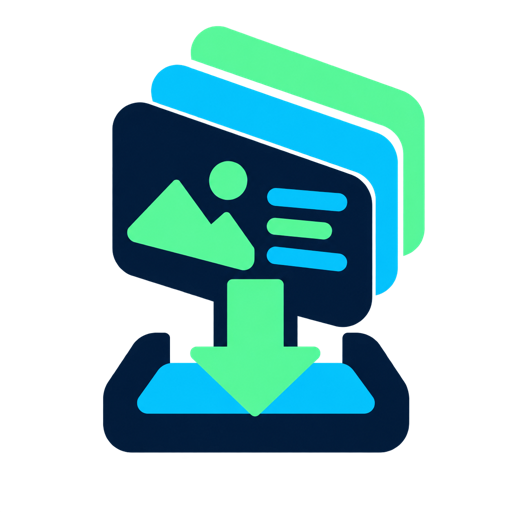
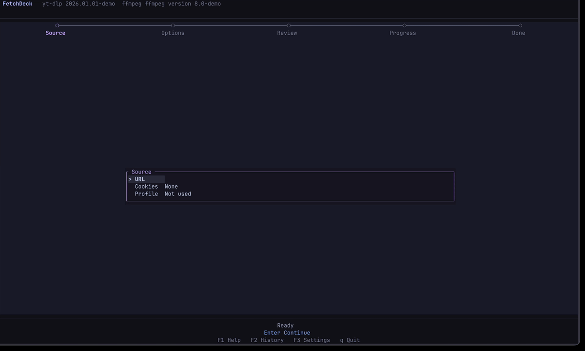

<p align="center">
  
</p>

<h1 align="center">FetchDeck</h1>

<p align="center">Download video, audio, and subtitles with <code>yt-dlp</code> from a macOS terminal UI.</p>

<p align="center">
  <a href="README.md"><kbd>English</kbd></a>
  <a href="README.zh-CN.md"><kbd>简体中文</kbd></a>
</p>

<p align="center">
  
</p>

FetchDeck turns a single video URL into a guided download. Paste the URL, choose an output, review the job, and follow its progress without writing `yt-dlp` commands.

## Quick start

FetchDeck requires macOS and [Homebrew](https://brew.sh/).

```sh
brew tap softmaxe/tap
brew install fetchdeck
fetchdeck
```

Homebrew installs `yt-dlp` and `ffmpeg` with FetchDeck.

## What it does

| Output | Options |
| --- | --- |
| Video | MP4 at the best available quality, 4K, 1080p, 720p, or 480p |
| Audio | M4A extraction |
| Subtitles | One manual subtitle track as SRT or VTT |

FetchDeck can also:

- Read cookies from local Chrome, Firefox, or Brave profiles after asking for confirmation.
- Show progress, speed, ETA, status, and recent `yt-dlp` output.
- Cancel and retry downloads while keeping partial files available to `yt-dlp`.
- Save settings and the latest 100 jobs locally.

It accepts one video URL at a time. Playlist and channel URLs are not supported.

## How it works

1. Paste a video URL and, if needed, select a browser profile for cookies.
2. Choose Video, Audio, or Subtitles and set the output options.
3. Review the detected metadata, selected format, and destination.
4. Start the job and follow its progress. When it finishes, open the result in Finder or start another download.

## Run from source

You need macOS, stable Rust with `cargo` on `PATH`, `yt-dlp`, and `ffmpeg`.

```sh
brew install yt-dlp ffmpeg
git clone https://github.com/softmaxe/fetch-deck.git
cd fetch-deck
cargo run
```

To build an optimized binary:

```sh
cargo build --release
./target/release/fetchdeck
```

FetchDeck reports missing tools in its header. You can set custom paths for `yt-dlp` and `ffmpeg` in Settings.

## Controls

| Key | Action |
| --- | --- |
| `j` / `k`, Up / Down | Move between fields or scroll content |
| Left / Right | Change the selected option |
| Page Up / Page Down | Scroll Review or the Progress log by ten lines |
| `Enter` | Continue, start a job, or edit a setting |
| `Esc` | Go back, stop the metadata probe, or close a panel |
| `c` | Cancel the active download |
| `n` / `r` / `o` | Start a new job, retry, or open the result in Finder |
| `F1` / `F2` / `F3` | Open Help, History, or Settings |
| `x` | Clear History while its panel is open. Downloaded files remain untouched. |
| `e` / `s` | Edit or save Settings while its panel is open |
| `q` | Quit. An active download requires confirmation. |

Mouse input works too. Click fields and options, or use the wheel to scroll Review and Progress.

## Cookies, privacy, and local data

FetchDeck asks before reading browser cookies. On the first successful probe, the local `yt-dlp` executable exports the selected profile's cookies to a private temporary file. FetchDeck reuses that file for the current session and deletes it on exit.

Logs and errors hide the cookie file path and browser authentication details. Settings and history never store the selected browser, profile, cookie file, or generated command. FetchDeck sends no telemetry.

Settings store the output directory and optional paths to `yt-dlp` and `ffmpeg`. History stores the URL, title, result, output path, and timestamp for up to 100 jobs. Clearing History does not delete downloaded files. macOS stores both files in the standard application directories for `com.softmaxe.fetchdeck`.

Some browsers lock their cookie database while open. Close the selected browser and retry if FetchDeck cannot read it.

## Limitations

- No playlists, channels, site search, or custom `yt-dlp` arguments
- No MP3 conversion
- No embedded or automatically generated subtitles
- No pause, background downloads, or automatic resume across app sessions
- No Safari or Edge cookies, or `cookies.txt` import
- `yt-dlp` and `ffmpeg` are not bundled or updated by FetchDeck

## Rebuild the demo

The demo uses fixed offline metadata and generic `/tmp/fetchdeck-demo-*` paths. It does not access browser profiles, real video URLs, or the current user's download directory.

```sh
brew install vhs
cargo build --release
vhs docs/demo/demo.tape
```

The tape uses JetBrains Mono 16 and Catppuccin Mocha. VHS renders an opaque background, so it omits Ghostty blur and transparency.

## License

[AGPL-3.0](LICENSE)
